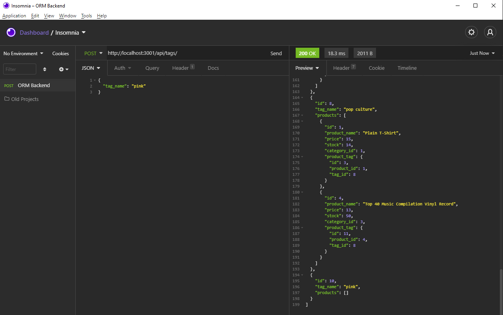
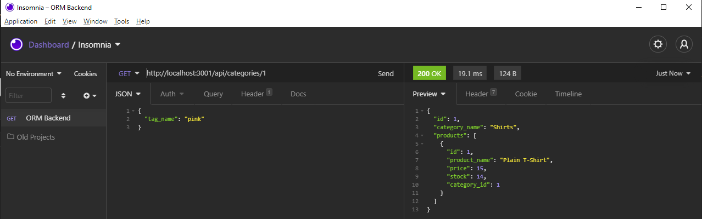

# ORM Backend

## Description
The back end for an e-commerce site that utilizies a working Express.js API and Sequelize to interact with a MySQL database. This application is not deployed and can only be accessed through the command-line and Insomnia.

## Table of Contents
  * [Installation](#installation)
  * [Usage](#usage)
  * [License](#license)
  * [Contributing](#contributing)
  * [Tests](#tests)
  * [Screenshots](#screenshots)
  * [Questions](#questions)

  ## Installation
  To use this application, you will need to clone the repository found [here](https://github.com/alyssawinn/orm-backend), download Node to your local machine, install Dotenv, Sequelize, Express, and MySql using the command 'npm install sequelize mysql2 dotenv express' in your terminal. This will add the necessary node_modules folder and ability to do SQL in the terminal and utilize Sequelize. Run 'schema.sql' and then do 'npm run seed' from the terminal to add the current database to the program. Once that's complete, you can type 'npm start' in the terminal to start the application and use the associated URL's to create, read, update, and destroy data in Insomnia.

  ## Usage
  Click [here](https://drive.google.com/file/d/19znFyBrOGMGz1d9yujo3Huv_Kgdg6CP3/view) to open instructional video on how to follow prompts to view, add, and update employees.
  
  ## License
  No licenses are required for this project

  ## Contributing
  N/A

  ## Tests
  N/A

  ## Screenshots
  

  

  ## Questions
  If you have any questions, please contact me at [alyssawinn2@gmail.com](mailto:alyssawinn2@gmail.com) or visit my GitHub page [here](https://github.com/alyssawinn/)